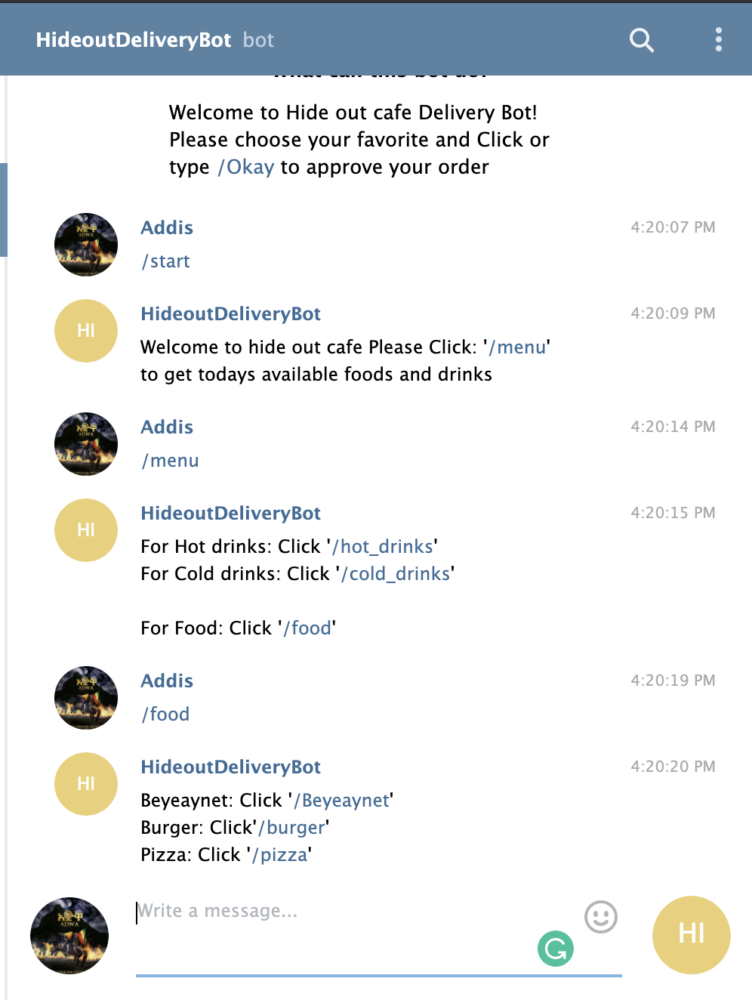

# Project Name: Telegram-Bot

> I asked to build a telegram bot. based on that I created a simple telegram bot that helps clients to order a delivery from Hideout cafe.



## Built With

- Ruby

## Getting Started

To get a local copy up and running follow these simple example steps.

- git clone git@github.com:Addis0943/Telegram-bot.git
- cd Telegram-bot
- Run bundle on terminal to install all dependencies
- run ruby bin/main.rb

### Prerequisites

- Basic knowledge Ruby
- computer
- Internet connection

### Setup

- Vs code
- Git
- Github

### Install

- Vs code
- Git
- Github

### To Use Rspec

To use the Rspec please copy the repository and run the following commands on your terminal:

```
$ cd <folder>
```

```
$ rspec
```

### Linters

Install some dependencies by running the following command

- Add gem 'rubocop', '~>0.81.0' to Gemfile
- Run bundle install

## Usage

- To use this bot run ruby bin/main in your terminal and search
  @HideoutdeliveryBot on Telegram
- This telegram bot helps you to order a fast food from HideOut cafe. so in order to use the bot effectively follow the following steps:

```
- Click the Start Button
- Click Menu to get list of available foods
- Click on available food and select as much as you needed
- Click on Enough when you finished
- Finally Click on Okay to approve your order
```

👤 **Addis.B**

- GitHub: [@Addis0943](https://github.com/Addis0943)
- Twitter: [@Addis32018084](https://twitter.com/Addis32018084)
- LinkedIn: [LinkedIn](https://www.linkedin.com/in/addis-belete-134b98191/)

## 🤝 Contributing

Contributions, issues, and feature requests are welcome!

Feel free to check the [issues page](issues/).

## Show your support

Give a ⭐️ if you like this project!

## Acknowledgments

- Hat tip to anyone whose code was used
- Inspiration
- etc

## 📝 License

This project is [MIT](lic.url) licensed.
